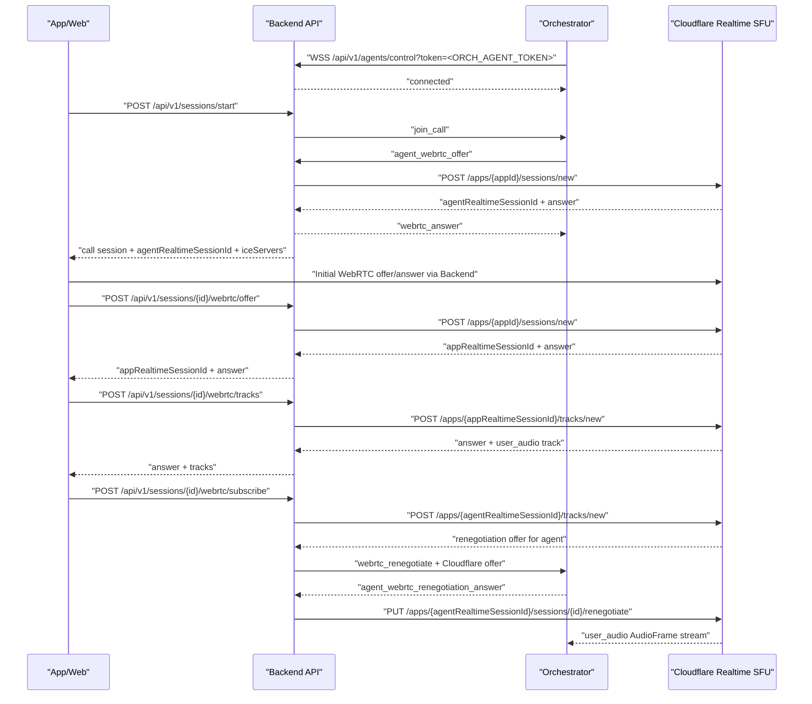

# MollaTalk Frontend/App WebRTC Integration Guide

이 문서는 웹 프론트와 앱 개발자가 MollaTalk 통화 연결을 구현할 때 따라야 하는 현재 API 계약을 정리한다.

현재 통화 연결은 세 갈래로 나뉜다.

- 앱/웹 클라이언트: 사용자 JWT로 백엔드 API를 호출하고, Cloudflare Realtime SFU에 WebRTC로 음성을 보낸다.
- 백엔드 서버: 사용자 세션을 만들고, 오케스트레이터 agent WSS와 Cloudflare Realtime API 사이의 signaling을 중계한다.
- 오케스트레이터: 백엔드에 WSS로 상시 연결되어 있다가 `join_call`을 받고 Cloudflare Realtime SFU에 WebRTC로 붙는다.

앱/웹은 오케스트레이터 WSS에 직접 접속하지 않는다. 앱/웹의 media는 백엔드를 통과하지 않고 Cloudflare Realtime SFU로 흐른다.

## 1. 전체 흐름



## 2. 클라이언트가 보관해야 하는 값

통화 중에는 다음 값을 메모리에 보관한다.

| 값 | 출처 | 사용 위치 |
| --- | --- | --- |
| `accessToken` | 로그인/인증 | 모든 앱 API의 `Authorization: Bearer ...` |
| `callSessionId` | `/api/v1/sessions/start` 응답 `data.id` | 이후 `/webrtc/*`, `/end` 경로 |
| `agentRealtimeSessionId` | `/api/v1/sessions/start` 응답 `data.agentRealtimeSessionId` | `/webrtc/offer`, `/webrtc/tracks`, `/webrtc/subscribe` 요청 본문 |
| `iceServers` | `/api/v1/sessions/start` 응답 `data.iceServers` | `new RTCPeerConnection({ iceServers })` |
| `appRealtimeSessionId` | `/webrtc/offer` 응답 `data.appRealtimeSessionId` | `/webrtc/tracks`, `/webrtc/subscribe` 요청 본문 |
| `trackName` | `/webrtc/tracks` 응답 `data.tracks[].trackName` | `/webrtc/subscribe` 요청 본문 |

`trackName`이 비어 있으면 기본값은 `user_audio`이다.

## 3. 공통 API 규칙

Base URL:

```text
https://api.mollatalk.com
```

모든 앱용 통화 API는 JWT가 필요하다.

```http
Authorization: Bearer <accessToken>
Content-Type: application/json
```

응답은 공통 래퍼를 사용한다.

```json
{
  "code": "SUCCESS",
  "message": "요청이 성공했습니다.",
  "data": {},
  "timestamp": "2026-06-19T10:00:00"
}
```

401이 오면 access token이 없거나 만료된 것이다. refresh 또는 재로그인 후 통화를 다시 시작한다.

## 4. API 상세

### 4.1 통화 시작

```http
POST /api/v1/sessions/start
```

요청 본문은 없다.

응답 예시:

```json
{
  "code": "SUCCESS",
  "message": "요청이 성공했습니다.",
  "data": {
    "id": "6faca8e7-a6c1-427e-a0f0-7368d8da8f07",
    "sessionType": "practice",
    "userStateAtCall": "subscribed",
    "startedAt": "2026-06-19T10:00:00",
    "endedAt": null,
    "durationSeconds": null,
    "subscription": {
      "id": "subscription-id",
      "planType": "free",
      "dailyLimitMinutes": 30,
      "remainingMinutesToday": 30,
      "startedAt": "2026-06-19T09:00:00",
      "expiresAt": null,
      "status": "active"
    },
    "agentRealtimeSessionId": "b0bd79aad16021eb6d4d37c1e37a29da",
    "iceServers": [
      {
        "urls": [
          "stun:stun.cloudflare.com:3478",
          "stun:stun.cloudflare.com:53"
        ]
      },
      {
        "urls": [
          "turn:turn.cloudflare.com:3478?transport=udp",
          "turn:turn.cloudflare.com:3478?transport=tcp",
          "turns:turn.cloudflare.com:5349?transport=tcp"
        ],
        "username": "turn-username",
        "credential": "turn-credential"
      }
    ],
    "status": "in_progress"
  },
  "timestamp": "2026-06-19T10:00:00"
}
```

클라이언트 처리:

1. `data.id`를 `callSessionId`로 저장한다.
2. `data.agentRealtimeSessionId`를 저장한다.
3. `data.iceServers`로 `RTCPeerConnection`을 만든다.
4. `agentRealtimeSessionId`가 없으면 통화를 시작하지 말고 오류를 표시한다.

### 4.2 앱 WebRTC 세션 생성

```http
POST /api/v1/sessions/{callSessionId}/webrtc/offer
```

이 API는 앱 쪽 Cloudflare Realtime session을 만든다. 이 단계에서는 마이크 track을 아직 publish하지 않는다. 먼저 `recvonly` audio transceiver로 Cloudflare와 PeerConnection을 연결한다.

권장 순서:

1. `new RTCPeerConnection({ iceServers })`
2. `pc.addTransceiver("audio", { direction: "recvonly" })`
3. `pc.createOffer()`
4. `pc.setLocalDescription(offer)`
5. ICE gathering 완료 또는 제한 시간 대기
6. `/webrtc/offer` 호출
7. 응답 answer를 `pc.setRemoteDescription(answer)`로 적용
8. WebRTC 연결 상태가 `connected` 또는 ICE `connected/completed`가 될 때까지 대기

요청 예시:

```json
{
  "agentRealtimeSessionId": "b0bd79aad16021eb6d4d37c1e37a29da",
  "sessionDescription": {
    "type": "offer",
    "sdp": "v=0\r\n..."
  },
  "tracks": []
}
```

응답 예시:

```json
{
  "code": "SUCCESS",
  "message": "요청이 성공했습니다.",
  "data": {
    "appRealtimeSessionId": "29351388b4f062baa795085112e10fda",
    "sessionDescription": {
      "type": "answer",
      "sdp": "v=0\r\n..."
    },
    "tracks": []
  },
  "timestamp": "2026-06-19T10:00:01"
}
```

클라이언트 처리:

1. `data.appRealtimeSessionId`를 저장한다.
2. `data.sessionDescription`을 `RTCSessionDescriptionInit`로 보고 `setRemoteDescription`에 넘긴다.
3. `appRealtimeSessionId` 또는 answer가 없으면 중단한다.

### 4.3 마이크 track publish

```http
POST /api/v1/sessions/{callSessionId}/webrtc/tracks
```

이 API는 앱의 마이크 track을 Cloudflare app session에 등록한다. 반드시 `/webrtc/offer` 응답 answer를 적용하고 PeerConnection이 연결된 뒤 호출한다.

권장 순서:

1. `navigator.mediaDevices.getUserMedia({ audio: true, video: false })`
2. 기존 audio transceiver의 sender에 `replaceTrack(audioTrack)`
3. transceiver direction을 `sendrecv`로 변경
4. `pc.createOffer()`
5. `pc.setLocalDescription(offer)`
6. ICE gathering 완료 또는 제한 시간 대기
7. local track metadata 구성
8. `/webrtc/tracks` 호출
9. 응답 answer를 `pc.setRemoteDescription(answer)`로 적용
10. outbound audio bytes가 증가하는지 확인

track metadata:

```json
[
  {
    "location": "local",
    "mid": "0",
    "trackName": "user_audio",
    "bidirectionalMediaStream": true,
    "kind": "audio"
  }
]
```

`mid`는 가능하면 `RTCRtpTransceiver.mid`를 사용한다. 아직 null이면 transceiver index를 문자열로 사용한다. 백엔드는 local track에 `kind=audio`, `bidirectionalMediaStream=true`가 없으면 보강하지만, 앱에서도 명시하는 것을 권장한다.

요청 예시:

```json
{
  "agentRealtimeSessionId": "b0bd79aad16021eb6d4d37c1e37a29da",
  "appRealtimeSessionId": "29351388b4f062baa795085112e10fda",
  "sessionDescription": {
    "type": "offer",
    "sdp": "v=0\r\n..."
  },
  "tracks": [
    {
      "location": "local",
      "mid": "0",
      "trackName": "user_audio",
      "bidirectionalMediaStream": true,
      "kind": "audio"
    }
  ]
}
```

응답 예시:

```json
{
  "code": "SUCCESS",
  "message": "요청이 성공했습니다.",
  "data": {
    "appRealtimeSessionId": "29351388b4f062baa795085112e10fda",
    "sessionDescription": {
      "type": "answer",
      "sdp": "v=0\r\n..."
    },
    "tracks": [
      {
        "mid": "0",
        "trackName": "user_audio"
      }
    ]
  },
  "timestamp": "2026-06-19T10:00:03"
}
```

클라이언트 처리:

1. `data.sessionDescription`을 `setRemoteDescription`에 적용한다.
2. `data.tracks`에서 `trackName`을 확인한다.
3. 보통 `trackName=user_audio`이다.
4. remote answer 적용 후 실제 outbound audio packet이 나가기 시작했는지 확인한 뒤 subscribe를 호출한다.

### 4.4 앱 오디오를 오케스트레이터에 연결

```http
POST /api/v1/sessions/{callSessionId}/webrtc/subscribe
```

이 API는 Cloudflare SFU에서 앱이 publish한 `user_audio` track을 오케스트레이터 WebRTC session에 연결한다. 이 호출 이후 백엔드는 오케스트레이터와 WebRTC renegotiation을 수행한다. 앱은 별도 renegotiation을 직접 처리하지 않는다.

요청 예시:

```json
{
  "agentRealtimeSessionId": "b0bd79aad16021eb6d4d37c1e37a29da",
  "appRealtimeSessionId": "29351388b4f062baa795085112e10fda",
  "trackName": "user_audio"
}
```

`trackName`은 생략할 수 있으며, 생략하면 백엔드가 `user_audio`로 처리한다.

응답 예시:

```json
{
  "code": "SUCCESS",
  "message": "요청이 성공했습니다.",
  "data": null,
  "timestamp": "2026-06-19T10:00:04"
}
```

정상 상태에서는 오케스트레이터 로그에 다음이 찍힌다.

```text
realtime_audio_track_received
realtime_audio_frame_received
```

앱에서는 subscribe 응답이 성공하면 통화 연결 상태로 표시한다.

### 4.5 통화 종료

```http
PATCH /api/v1/sessions/{callSessionId}/end
```

앱이 통화를 종료할 때 호출한다. 사용자가 종료 버튼을 눌렀거나, 앱이 통화 화면을 정상 종료할 때 호출한다.

요청 본문은 생략 가능하다.

```json
{}
```

필요하면 종료 상태와 duration을 보낼 수 있다.

```json
{
  "status": "completed",
  "durationMinutes": 3
}
```

응답 예시:

```json
{
  "code": "SUCCESS",
  "message": "요청이 성공했습니다.",
  "data": {
    "id": "6faca8e7-a6c1-427e-a0f0-7368d8da8f07",
    "sessionType": "practice",
    "userStateAtCall": "subscribed",
    "startedAt": "2026-06-19T10:00:00",
    "endedAt": "2026-06-19T10:03:00",
    "durationSeconds": 180,
    "subscription": null,
    "agentRealtimeSessionId": null,
    "iceServers": [],
    "status": "completed"
  },
  "timestamp": "2026-06-19T10:03:00"
}
```

클라이언트 처리:

1. `RTCPeerConnection.close()`를 호출한다.
2. 마이크 track을 모두 `stop()`한다.
3. `/end`를 호출한다.
4. 로컬에 저장한 `callSessionId`, `agentRealtimeSessionId`, `appRealtimeSessionId`를 비운다.

## 5. WebRTC 구현 상세

### 5.1 RTCPeerConnection 생성

```js
const pc = new RTCPeerConnection({
  iceServers: startResponse.data.iceServers,
  iceTransportPolicy: "all"
});
```

`iceTransportPolicy`는 기본적으로 `"all"`을 사용한다. 장애 분석을 위해 TURN만 강제해야 할 때만 `"relay"`를 사용한다.

### 5.2 초기 offer

```js
const audioTransceiver = pc.addTransceiver("audio", { direction: "recvonly" });
const offer = await pc.createOffer();
await pc.setLocalDescription(offer);
await waitForIceGatheringComplete(pc);
```

초기 offer에는 mic track을 싣지 않는다. 먼저 Cloudflare와 기본 WebRTC 연결을 만든 뒤 track publish 단계에서 mic를 붙인다.

### 5.3 마이크 publish offer

```js
const stream = await navigator.mediaDevices.getUserMedia({ audio: true, video: false });
const audioTrack = stream.getAudioTracks()[0];

await audioTransceiver.sender.replaceTrack(audioTrack);
audioTransceiver.direction = "sendrecv";

const publishOffer = await pc.createOffer();
await pc.setLocalDescription(publishOffer);
await waitForIceGatheringComplete(pc);
```

### 5.4 local track metadata 생성

```js
const tracks = pc.getTransceivers()
  .filter((transceiver) => transceiver.sender && transceiver.sender.track)
  .map((transceiver, index) => ({
    location: "local",
    mid: transceiver.mid ?? String(index),
    trackName: transceiver.sender.track.kind === "audio"
      ? "user_audio"
      : transceiver.sender.track.kind,
    bidirectionalMediaStream: true,
    kind: transceiver.sender.track.kind
  }));
```

### 5.5 outbound audio 확인

subscribe를 너무 빨리 호출하면 Cloudflare가 아직 publisher track을 찾지 못할 수 있다. `/webrtc/tracks` answer 적용 후 outbound audio bytes가 0보다 커질 때까지 짧게 대기한다.

```js
async function getOutboundAudioBytesSent(pc) {
  const stats = await pc.getStats();
  let bytesSent = 0;
  stats.forEach((report) => {
    if (report.type === "outbound-rtp" && report.kind === "audio" && !report.isRemote) {
      bytesSent += report.bytesSent || 0;
    }
  });
  return bytesSent;
}
```

## 6. 권장 클라이언트 상태 머신

```text
idle
  -> starting_backend_session
  -> creating_peer_connection
  -> connecting_cloudflare_session
  -> publishing_microphone_track
  -> subscribing_orchestrator
  -> in_call
  -> ending
  -> ended
```

오류 발생 시:

1. `pc.close()`
2. mic track `stop()`
3. 이미 backend session이 있으면 `/api/v1/sessions/{id}/end` 호출 시도
4. 사용자에게 재시도 안내

## 7. 구현 시 주의사항

- 앱/웹은 `/api/v1/agents/control`에 접속하지 않는다. 이 WSS는 오케스트레이터 전용이다.
- 앱/웹은 Cloudflare REST API를 직접 호출하지 않는다. Cloudflare API token은 백엔드에만 있어야 한다.
- `iceServers` 안의 TURN credential은 로그에 남기지 않는다.
- `agentRealtimeSessionId`와 `appRealtimeSessionId`를 혼동하지 않는다.
- `/webrtc/subscribe`는 `/webrtc/tracks` answer 적용 후 outbound audio가 실제로 나가기 시작한 뒤 호출한다.
- 브라우저는 HTTPS 또는 localhost가 아니면 microphone permission이 실패할 수 있다.
- iOS/Android 앱은 마이크 권한 요청 시점과 background 전환 시 track 정리를 명확히 처리해야 한다.

## 8. 디버깅 체크리스트

### 8.1 `/sessions/start` 응답에 `agentRealtimeSessionId`가 없음

- 오케스트레이터가 백엔드 WSS에 연결되어 있는지 확인한다.
- 백엔드 로그에서 `agent_control_connected`를 확인한다.
- 오케스트레이터 로그에서 `agent_control_connected`를 확인한다.

### 8.2 `/webrtc/offer` 실패

- local offer의 `sessionDescription.type`이 `offer`인지 확인한다.
- `agentRealtimeSessionId`가 `/sessions/start` 응답값인지 확인한다.
- ICE gathering 후 SDP에 candidate가 있는지 확인한다.

### 8.3 `/webrtc/tracks` 실패

- `appRealtimeSessionId`가 `/webrtc/offer` 응답값인지 확인한다.
- mic track이 실제 sender에 붙었는지 확인한다.
- tracks metadata에 `location=local`, `mid`, `trackName=user_audio`, `kind=audio`가 있는지 확인한다.

### 8.4 `/webrtc/subscribe` 후 오케스트레이터가 음성을 못 받음

백엔드 로그에서 다음을 확인한다.

```text
app_realtime_state_before_agent_subscribe ... tracks=[{location=local, trackName=user_audio, mid=0, status=active}]
agent_subscribed_to_user_audio ... requiresImmediateRenegotiation=true
agent_renegotiate_sent
```

오케스트레이터 로그에서 다음을 확인한다.

```text
realtime_renegotiation_answer_sent
realtime_audio_track_received
realtime_audio_frame_received
```

`realtime_audio_frame_received`가 계속 증가하면 앱 마이크 음성이 Cloudflare SFU를 거쳐 오케스트레이터까지 도착한 것이다.

## 9. 최소 구현 의사코드

```js
async function startMollaCall(accessToken) {
  const start = await post("/api/v1/sessions/start", null, accessToken);
  const callSessionId = start.data.id;
  const agentRealtimeSessionId = start.data.agentRealtimeSessionId;

  const pc = new RTCPeerConnection({ iceServers: start.data.iceServers });
  const audioTransceiver = pc.addTransceiver("audio", { direction: "recvonly" });

  await pc.setLocalDescription(await pc.createOffer());
  await waitForIceGatheringComplete(pc);

  const appSession = await post(`/api/v1/sessions/${callSessionId}/webrtc/offer`, {
    agentRealtimeSessionId,
    sessionDescription: pc.localDescription,
    tracks: []
  }, accessToken);

  const appRealtimeSessionId = appSession.data.appRealtimeSessionId;
  await pc.setRemoteDescription(appSession.data.sessionDescription);
  await waitForPeerConnectionReady(pc);

  const stream = await navigator.mediaDevices.getUserMedia({ audio: true, video: false });
  await audioTransceiver.sender.replaceTrack(stream.getAudioTracks()[0]);
  audioTransceiver.direction = "sendrecv";

  await pc.setLocalDescription(await pc.createOffer());
  await waitForIceGatheringComplete(pc);

  const publishTracks = buildLocalTrackMetadata(pc);
  const published = await post(`/api/v1/sessions/${callSessionId}/webrtc/tracks`, {
    agentRealtimeSessionId,
    appRealtimeSessionId,
    sessionDescription: pc.localDescription,
    tracks: publishTracks
  }, accessToken);

  await pc.setRemoteDescription(published.data.sessionDescription);
  await waitForOutboundAudioPackets(pc);

  const trackName = published.data.tracks?.[0]?.trackName || "user_audio";
  await post(`/api/v1/sessions/${callSessionId}/webrtc/subscribe`, {
    agentRealtimeSessionId,
    appRealtimeSessionId,
    trackName
  }, accessToken);

  return { pc, stream, callSessionId, agentRealtimeSessionId, appRealtimeSessionId };
}
```

## 10. 테스트 페이지

웹 구현 참고용 테스트 페이지는 다음 파일에 있다.

```text
docs/dev/webrtc-test.html
```

로컬에서 확인할 때:

```bash
cd docs/dev
python3 -m http.server 3000
```

브라우저에서 `http://localhost:3000/webrtc-test.html`을 열고 access token을 붙여넣어 테스트한다.
